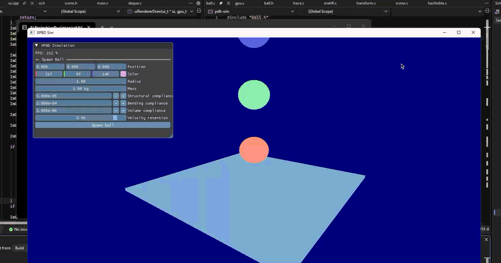

# XPBD Simulation

A simulation for XPBD: Position-Based Simulation of Compliant Constrained Dynamics.

  

Inspired by: https://matthias-research.github.io/pages/publications/XPBD.pdf

This system includes various game engine support for ease of usability.